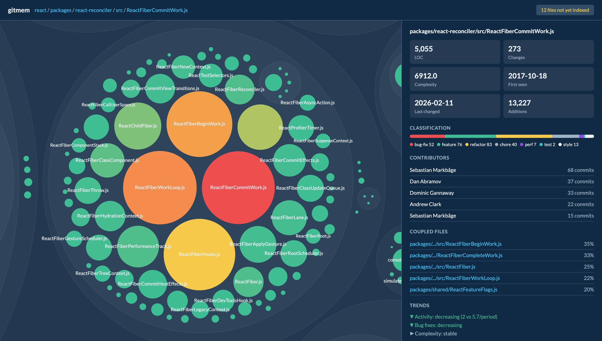

<div align="center">

# gitmem

gitmem indexes your git history with LLM-powered commit classification, then surfaces patterns — hotspots, file coupling, change trends — at query time with no LLM calls. Built for humans and AI agents alike.

</div>

```sh
# Initialize and index your repo (enriches commits via a LLM)
gitmem init --ai true
gitmem index

# Use the index to surface patterns and insights
gitmem stats src/db          # Tell me everything about this path
gitmem hotspots              # What files change the most?
gitmem coupling src/db.ts    # What changes alongside this file?
gitmem trends src/services   # Is this area stabilizing or getting worse?
gitmem query "auth"          # Search commit history
```

`gitmem visualize` renders an interactive codebase explorer:

<div align="center">
<table>
<tr>
<td align="center"></td>
<td align="center"></td>
</tr>
<tr>
<td align="center"><sub>Repository overview — React codebase</sub></td>
<td align="center"><sub>File drill-down — ReactFiberCommitWork.js</sub></td>
</tr>
</table>
</div>

## Table of Contents

1. **[Setup](#setup)**
2. **[Development](#development)**
3. **[Usage](#usage)**
4. **[How `gitmem index` Works](#how-gitmem-index-works)**
5. **[Motivation](#motivation)**

## Setup

Requires [Bun](https://bun.sh). Once installed, clone the project, install dependencies, and build the CLI.

```sh
git clone git@github.com:jmcdonald-ut/gitmem.git && cd gitmem
bun install
```

The project is now primed for producing a build or proceeding with development. Produce a binary like so:

```sh
bun run build   # Compile to standalone binary at build/gitmem
```

The produced binary can be found at `build/gitmem`. Add it to your path or copy it into a shared bin folder.

AI enrichment is enabled by default and requires an Anthropic API key. It can be disabled or date-limited in `.gitmem/config.json` (created by `gitmem init`), in which case no API key is needed.

```sh
# Initialize gitmem in your repository
gitmem init

# One-time use
ANTHROPIC_API_KEY="sk-ant-..." gitmem index

# Or export for repeated use
export ANTHROPIC_API_KEY="sk-ant-..."
gitmem index
```

## Development

```bash
bun test             # Run tests
bun run lint         # ESLint
bun run typecheck    # TypeScript type checking
bun run format       # Prettier
bun run build        # Compile to standalone binary at build/gitmem
```

## Usage

**Heads up:** Most commands require that the repo has been indexed first (`gitmem index`). For repos with an extensive history, use `--batch` to help reduce costs by ~50% (`gitmem index --batch`).

```sh
Usage: gitmem [options] [command]

AI-powered git history index

Options:
  -V, --version                output the version number
  --format <format>            Output format (text or json) (default: "text")
  --json                       Shorthand for --format json
  -h, --help                   display help for command

Commands:
  init [options]               Initialize gitmem in the current repository
  index|i [options]            Analyze new commits via Claude API and rebuild search index
  status|s                     Show index health, coverage, and database statistics
  query|q [options] <query>    Full-text search over enriched commits (no API calls)
  check [options] [hash]       Evaluate enrichment quality via LLM-as-judge
  hotspots|h [options]         Show most-changed files with classification breakdown
  stats [options] <path>       Show detailed change statistics for a file or directory
  coupling|c [options] [path]  Show files that frequently change together
  trends|t [options] <path>    Show change velocity and classification mix over time
  schema                       Display database schema documentation
  visualize|viz [options]      Open an interactive visualization of the repository
  generate                     Generate project files
  help [command]               display help for command

Getting started:
  1. Initialize gitmem:              gitmem init
  2. Export your Anthropic API key:  export ANTHROPIC_API_KEY=sk-ant-...
  3. Run the indexer:                gitmem index
  4. Search your history:            gitmem query "auth bug"

Global options --format json and --json work with every command.
Run gitmem schema for database table documentation.
```

## How `gitmem index` Works

`gitmem index` runs a five-phase pipeline:

```
1. Discover   — extract commit metadata and file stats from git
2. Measure    — compute indentation-based complexity metrics for changed files
3. Enrich     — classify each commit via Claude API (skipped if AI is disabled; date-filtered if configured)
4. Aggregate  — compute per-file analytics: change hotspots, contributor breakdown, file coupling
5. Index      — rebuild SQLite FTS5 full-text search index
```

## Motivation

I'm building `gitmem` for fun while also trying:

- To learn more about behavioral code analysis
- To see if behavioral code analysis benefits when augmented with AI
- To see if the resulting data can help coding agents with their tasks
- And, to a lesser extent, to see what [Bun, the all-in-one-toolkit for TS applications](https://bun.sh/), is all about

Credit for most of the written code goes to [Claude Code](https://code.claude.com/docs/en/overview). I've let it do a lot of the heavy lifting so I can focus on the above bullets.
